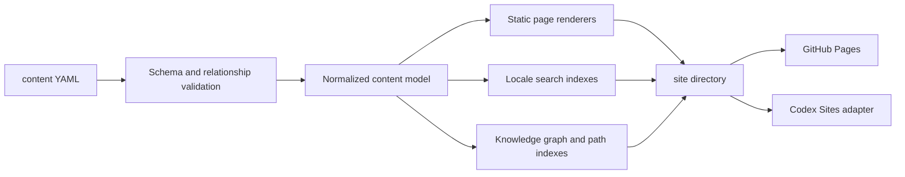

# Vibe Terms 本地静态平台设计规范

> 状态：待用户审阅；本文件只定义后续实现，不授权本轮修改网页、推送或部署。
> 修订日期：2026-08-16
> 取代：`2026-08-15-vibe-terms-platform-design.md`
> 配套计划：`docs/superpowers/plans/2026-08-16-vibe-terms-local-static-expansion.md`

## 1. 摘要

Vibe Terms 是面向 Vibe Coding 初学者的多语言术语学习站。产品不是只列出定义的词典，而是把“查词、理解、动手、练习、沿项目继续学习”连成一条无需登录的本地学习路径。

本次修订保留当前已经验证的静态架构：

- `content/` 是术语、分类、知识关系和项目路径的唯一内容源；
- Python 生成器输出普通 HTML、CSS、JavaScript；
- 所有公开内容在关闭 JavaScript 后仍可阅读；
- 搜索、收藏、练习和学习进度只在浏览器本地运行；
- GitHub Pages 是公开静态发布目标，Codex Sites 保留为同一静态产物的另一个打包目标；
- 不引入数据库、Supabase、账号、登录、云同步或服务端 API。

补充内容包已经提供 500 个规范词、12 个一级领域和 8 个语言文件。当前交付因此调整为：全量生成 500 词静态页面，同时优先富化 60 个高频核心词，完成 3 条可执行项目路径、每词小练和分层示例；未人工审校的翻译必须保持 `draft` 并 `noindex`。

## 2. 产品目标与非目标

### 2.1 目标

1. 用户在任意页面首屏都能立即搜索术语、别名、缩写、含义和项目目标。
2. 用户既能按知识领域建立概念地图，也能按真实项目完成顺序学习。
3. 单页词条在不造成认知过载的前提下，提供足够完整的解释、演示、练习和下一步。
4. 练习、收藏、阅读与路径进度完全保存在当前浏览器，并支持显式导出、导入和清空。
5. 8 个固定语言路由全部保留：`en`、`zh-cn`、`zh-tw`、`ja`、`ko`、`de`、`ru`、`hi`。
6. 同一份静态产物可在本地、GitHub Pages、自定义域名和 Codex Sites 上运行。
7. 内容扩充可批量进行，但质量门禁阻止空泛翻译、重复词条、断链关系和未完成页面上线。

### 2.2 明确不做

- 用户账号、登录、注册、头像或任何类似账号入口的界面；
- Supabase、数据库、云同步、跨设备同步和服务端学习记录；
- 支付、订阅、付费墙、提醒、推送通知和分析埋点；
- 用户可执行任意代码的在线沙箱；
- 在线内容编辑后台；内容编辑继续通过 Git 和内容文件完成；
- 依赖 GitHub Pages 或 Codex Sites 专有运行时的业务逻辑；
- 把参考站点的文案、插图、代码或视觉外观直接复制进项目。

## 3. 已确认产品决策

| 决策 | 结论 |
| --- | --- |
| 核心受众 | 第一次接触 Vibe Coding、需要把术语放进真实项目语境的学习者 |
| 公开形态 | 匿名静态网站 |
| 内容源 | Git 仓库中的 YAML 与受版本管理的静态资源 |
| 英文地位 | 英文名称和含义是规范源；本地化页始终显示规范英文名 |
| 搜索 | 构建期生成每语言索引，浏览器本地检索 |
| 学习数据 | IndexedDB 为结构化主存储，localStorage 仅作小偏好和显式降级 |
| 分类 | 知识地图与项目路径是两套独立但互相关联的系统 |
| 动态示例 | 预制、确定性、无 `eval` 的交互模块；不运行用户输入代码 |
| 发布 | `main` 通过验证后生成静态产物并发布到 GitHub Pages |
| 当前代码路线 | 延续 Python 生成器和 `web/` 运行时，不迁移到 Astro/Next 应用框架 |

## 4. 参考基线与当前差距

2026-08-16 对 [vibe-hub.org](https://vibe-hub.org/) 的公开页面只读核对显示，值得吸收的是信息架构而不是品牌外观：

- 搜索框常驻顶部导航，用户无需先穿过大段首屏文案；
- 首页同时提供一级领域、二级目录和每类数量；
- 词条卡直接呈现用户会说的话和可视例子；
- 词条页包含简明定义、先修词、别名、交互演示、易混点、单题小练、Agent 提示、下一词和权威来源；
- 练习有独立入口；
- 路线按真实项目目标分章，而不是把生命周期标签伪装成课程。

当前 Vibe Terms 的主要差距：

| 方面 | 当前原型 | 目标状态 |
| --- | --- | --- |
| 搜索位置 | 首页 Hero 内，离开首页后没有等价强入口 | 桌面端固定在顶部导航；移动端顶部按钮打开全宽搜索层 |
| 分类深度 | 7 个一级领域，缺少稳定二级目录 | 12 个一级领域 + 可扩展二级主题 + 数量与交叉筛选 |
| 词条密度 | 定义、类比、用途、提示词、误区、相关词 | 增加先修、别名、场景、动态/分步示例、小练、来源、路径归属和上下词 |
| 知识地图 | 领域卡和相关词链接 | 可浏览的领域/主题层级 + 先修有向图 + 无障碍列表视图 |
| 项目路径 | 单个 12 词顺序文件 | 独立路径目录、章节、产物、验收、关联词和本地进度 |
| 内容规模 | 12 个代表词 | 本轮 500 全量覆盖；60 个核心词优先富化 |
| 发布 | 静态产物和 Sites 适配已存在 | 补齐 GitHub Pages 子路径构建、CI 发布和线上读回 |

这些观察不是逐像素对标，也不要求复制参考站全部能力。Vibe Terms 的差异化是：8 语言、知识图与项目路径双导航、Git 内容治理、纯静态和明确的本地隐私边界。

## 5. 用户与主要旅程

### 5.1 临时查词

1. 用户从任意页面看到顶部搜索。
2. 输入中文、英文、别名、缩写、常见问法或项目目标。
3. 结果按“术语、知识主题、项目路径”分组，并显示命中原因。
4. 打开词条后先看到一句话答案，再按需阅读示例和练习。

### 5.2 建立知识地图

1. 用户打开“知识地图”。
2. 先选择一级领域，再进入二级主题。
3. 看到建议起点、先修关系、已学/未学状态和相关概念。
4. 图形视图不可用或屏幕较窄时，使用语义等价的分组列表。

### 5.3 沿项目路径学习

1. 用户打开“项目路径”，选择想完成的产物，而不是先选择抽象技术。
2. 路径页说明前置条件、最终产物、章节数和预计范围。
3. 每章包含目标、关联术语、动手任务、验收步骤和下一章。
4. 阅读/完成状态保存在本地；用户可随时重置或导出。

### 5.4 独立练习

1. 用户从导航或词条页进入练习。
2. 系统优先出错题和到期复习，再出路径相关题与新题。
3. 提交后立即解释为什么正确、其他选项错在哪里，并回链词条。
4. 无可用本地存储时仍可练习，只是不跨刷新保留进度。

## 6. 顶层信息架构

### 6.1 主导航

固定主导航只包含：

1. `术语`
2. `知识地图`
3. `项目路径`
4. `练习`
5. 全局搜索
6. 语言与主题切换

不出现登录、账户、同步、云端或会员入口。

### 6.2 路由

每个语言都生成以下静态路由：

```text
/{locale}/
/{locale}/terms/
/{locale}/terms/{term-slug}/
/{locale}/knowledge/
/{locale}/knowledge/{domain-id}/
/{locale}/knowledge/{domain-id}/{topic-id}/
/{locale}/paths/
/{locale}/paths/{path-slug}/
/{locale}/paths/{path-slug}/{chapter-slug}/
/{locale}/practice/
```

旧的 `/{locale}/categories/{domain-id}/` 在迁移期生成带规范链接的兼容页，至少保留一个公开版本，之后才可删除。

## 7. 全局搜索体验

### 7.1 位置与响应式行为

- 桌面宽度 `>= 1024px`：搜索框始终显示在粘性顶部导航中，宽度在 `320px` 到 `520px` 之间，页面滚动后仍可见。
- 平板与手机：顶部保留明确的“搜索”图标和文字标签；打开后显示全宽搜索层并自动聚焦输入框。
- 首页可在简短价值说明后重复一个更宽的搜索入口，但顶部入口始终存在，且首屏不得被大幅 Hero 推迟。
- `/` 和 `Ctrl/Cmd + K` 聚焦或打开搜索；`Escape` 关闭；上下方向键移动；`Enter` 打开；焦点返回触发按钮。

### 7.2 索引与排序

每个语言构建一个静态 JSON 索引，包含：

- 本地化标题、规范英文名、别名和缩写；
- 一句话定义和常见问法；
- 一级领域、二级主题和生命周期阶段；
- 所属项目路径与章节标题；
- 难度、发布状态和 URL。

排序依次考虑：规范名精确匹配、本地标题精确匹配、别名精确匹配、前缀、词边界、定义与场景、领域和项目路径。当前语言结果优先，规范英文名永远可搜。模糊匹配只在无高置信结果后启用。

### 7.3 结果设计

- 输入为空：展示最近查看、本地收藏和常用入口；读取失败则展示固定热门词，不暴露技术错误。
- 有结果：分为“术语”“知识主题”“项目路径”，每项显示命中字段和一句话说明。
- 无结果：保留查询词，建议更短关键词、英文名或分类浏览。
- 索引加载失败：正文和分类链接仍可使用，显示可重试提示。

## 8. 双分类系统

### 8.1 知识地图：概念如何关联

知识地图回答“这是什么、属于哪里、先学什么”。它包含三层：

1. 一级领域：稳定、数量少、用于全站主浏览；
2. 二级主题：更具体的概念簇，可随语料扩展；
3. 术语节点：通过先修和相关关系连接。

首版一级领域：

| ID | 中文名称 | 范围 |
| --- | --- | --- |
| `ai-vibe` | AI 与 Vibe Coding | 模型、提示、上下文、Agent、RAG |
| `web-ui` | Web 与界面 | HTML/CSS/JS、组件、状态、可访问性 |
| `app-platform` | 应用与跨平台 | 原生、跨端、设备与应用结构 |
| `backend-api` | 后端与 API | 服务、HTTP、接口、Webhook、无服务器函数 |
| `data-storage` | 数据与存储 | 数据库、SQL、Schema、迁移、缓存、对象存储 |
| `security-identity` | 安全与身份 | 认证、授权、会话、密钥、浏览器安全边界 |
| `git-quality-ship` | Git、质量与上线 | 版本控制、测试、调试、CI/CD、部署与回滚 |
| `product-design` | 产品、设计与交付 | 需求、信息架构、原型、验收和维护 |

先修关系必须构成有向无环图；“相关词”允许双向或环。知识地图同时提供图形视图和完整列表视图，列表不是降级提示，而是移动端和辅助技术的一等界面。

### 8.2 项目路径：完成什么项目

项目路径回答“为了做成这个东西，下一步做什么”。它不是生命周期筛选，也不是简单词条数组。每条路径必须包含：

- 项目目标、适合人群、前置条件和最终产物；
- 8–12 个有序章节；
- 每章的学习目标、必学词、选学词、动手任务、产物和验收步骤；
- 完成状态、继续入口和关联知识地图节点；
- 最终复盘与可复制给 AI Agent 的需求摘要。

首个里程碑交付三条路径：

1. `ship-a-product-site`：从想法到上线一个响应式产品站；
2. `build-a-local-crud-tool`：构建一个本地数据增删改查工具；
3. `build-an-ai-chat-assistant`：构建带上下文、错误状态和安全边界的 AI 对话助手。

后续扩展数据看板、自动化 Agent、跨平台应用等路径。一个术语可以出现在多个路径和章节中，但知识分类只有一个主要领域，可以有多个二级主题。

### 8.3 生命周期标签

`idea`、`requirements`、`design`、`environment`、`interface-logic`、`data-identity`、`test-protect`、`deploy-maintain` 继续作为横向筛选标签。它们不能替代项目路径；路径章节可以引用一个或多个生命周期阶段。

## 9. 页面设计

### 9.1 首页

首屏顺序固定为：粘性导航和全局搜索、两行以内的产品价值说明、三种明确入口（查术语、看知识地图、选项目路径）。随后展示：

- 一级领域卡：名称、二级主题样例、词条数量；
- 项目路径卡：目标产物、章节数、进度；
- 推荐起点：按初学者和本地历史选择，但无历史时完全确定；
- 内容规模与本地隐私说明。

首页不再把全部词条长列表与营销 Hero 堆在首屏。全部词条进入独立页，首页只负责方向选择。

### 9.2 术语列表与知识主题页

- 一级领域使用横向可滚动或换行的筛选标签，并显示数量；
- 二级主题使用侧栏/折叠目录，移动端变为顶部选择器；
- 词条卡显示本地标题、英文名、一句话定义、所属主题、难度、是否有互动示例和路径归属；
- 支持领域、主题、生命周期、难度和“有互动示例”筛选；
- 无 JavaScript 时输出完整分组列表和普通链接。

### 9.3 词条详情页

信息顺序采用“先答案、后理解、再动手、最后扩展”：

1. 面包屑、上一个/下一个、收藏和复制 Markdown；
2. 本地标题、规范英文名、发音（只有可靠本地资源时）、别名、领域、主题、难度；
3. “你可能会这样说”的真实场景；
4. 一句话定义和边界说明；
5. 先修词和“容易与什么混淆”；
6. 动态或分步示例；
7. 为什么重要、工作中的常见情形和失败模式；
8. 一道可即时反馈的小练；
9. 可复制给 AI Agent 的请求模板；
10. 所属项目路径与接下来学什么；
11. 权威来源和内容版本信息。

桌面端可使用正文 + 右侧页内目录；移动端保持单列。初始定义、例子说明、问题和链接都写入 HTML，JavaScript 只增强切换、答题和本地状态。

### 9.4 动态示例

每个词条都必须有“示例模块”，但不强迫抽象概念做无意义动画：

- `interactive`：切换状态、操作控件、观察前后变化；
- `stepper`：按步骤展示请求链路、Git 流程或数据流；
- `compare`：错误/正确、前/后或两个易混概念并排；
- `static`：当互动不会增加理解时，用高质量图解或代码到结果的静态对应。

互动示例由受信任的 `example_id` 选择预制渲染器，只接受经过 Schema 校验的数据。禁止 `eval`、动态拼接脚本、用户代码执行和第三方嵌入。关闭 JavaScript时显示第一状态、完整说明和所有状态的文本摘要。

### 9.5 练习页

练习题型首版只做三类：单选判断、场景选择、步骤排序。每个已发布词至少一题，选项都必须有解释。题目可按“到期复习、某个领域、某条路径、收藏词、全部”启动。

练习结果只保存在本地；匿名状态下也不显示“登录以同步”之类文案。

### 9.6 项目路径页

路径目录按“要完成的产物”分组。路径详情展示章节、必学词、预计范围、已完成数和继续按钮。章节页包含：

1. 本章目标；
2. 需要先懂的词；
3. 项目上下文；
4. 一项明确的动手任务；
5. 可保存到本地的完成勾选；
6. 可重复的验收步骤；
7. 下一章和关联词条。

## 10. 内容模型

### 10.1 目录

```text
content/
  taxonomy/
    domains.yaml
    topics.yaml
    lifecycle.yaml
  paths/
    <path-slug>/
      meta.yaml
      en.yaml
      zh-cn.yaml
      zh-tw.yaml
      ja.yaml
      ko.yaml
      de.yaml
      ru.yaml
      hi.yaml
  terms/
    <term-slug>/
      meta.yaml
      en.yaml
      zh-cn.yaml
      zh-tw.yaml
      ja.yaml
      ko.yaml
      de.yaml
      ru.yaml
      hi.yaml
  ui.yaml
```

`site/` 与 `dist/` 继续是忽略的生成目录，不得手工编辑或提交。

### 10.2 术语元数据

```yaml
id: term_state
slug: state
canonical_name: State
aliases: [UI State]
primary_domain: web-ui
topics: [frontend-state]
lifecycle_stages: [interface-logic, test-protect]
difficulty: beginner
prerequisites: [component]
related_terms: [database, session]
example:
  mode: interactive
  id: form-save-state
content_version: 2
```

关系字段只保存 slug，不保存显示名称。构建必须拒绝不存在的领域、主题、词条、示例和路径引用。

### 10.3 本地化教学内容

```yaml
title: 状态
short_definition: 界面当前需要记住、并会随操作或结果变化的信息。
boundary: 它不等于组件本身，也不自动等于数据库里的长期数据。
user_says: 提交后先显示保存中，成功或失败后再更新提示。
analogy: ...
why_it_matters: ...
work_scenarios: [...]
common_mistakes: [...]
example_copy:
  title: 一次保存怎样经过等待、成功和失败
  states: {...}
exercise:
  type: single-choice
  prompt: ...
  options: [...]
  answer: save-after-success
  explanations: {...}
agent_prompt: ...
sources:
  - title: ...
    url: https://...
status: reviewed
source_content_version: 2
```

英文文件是含义源。英文 `content_version` 变化后，翻译必须更新 `source_content_version` 才能恢复 `reviewed`。所有语言文件必须有相同的结构键、题目选项 ID 和示例状态 ID。

### 10.4 项目路径数据

`meta.yaml` 保存顺序和关系；语言文件保存教学文案。章节结构必须包含稳定 `chapter_id`、必学词、选学词、生命周期阶段和完成产物。构建器验证：章节 ID 唯一、必学词存在、章节顺序连续、路径至少 8 章且不超过 12 章、最终章包含整体验收。

## 11. 内容规模与质量门禁

### 11.1 分阶段目标

| 阶段 | 规范词条 | 项目路径 | 示例要求 | 练习要求 |
| --- | ---: | ---: | --- | --- |
| 核心富化 | 60 | 3 | 每词有示例模块，至少 20 个互动/分步示例 | 每词至少 1 题 |
| 全量覆盖 | 500 | 3 | 其余词保留可读静态示例 | 每词至少 1 题，路径节点有综合题 |
| 后续深化 | 500 | 12+ | 仅在提高理解时增加互动 | 核心词增加综合题与人工审校 |

### 11.2 发布门禁

词条只有在以下条件全部满足时才进入正式索引：

- 英文规范内容通过人工审阅；
- 8 个语言文件齐全，发布状态符合明确的语言回退规则；
- 示例、题目、答案解释和至少一个权威来源存在；
- 所有先修、相关、主题和路径引用有效；
- 没有通用占位翻译、复制粘贴重复段落或未替换模板；
- 生成后的词条页、搜索索引和站内链接通过自动检查。

批量扩词以 8–12 个词为一个内容批次；每批单独审阅和提交，禁止一次性生成 488 个未经核验的词。

## 12. 应用架构与数据流

### 12.1 保留的技术路线

- Python 3.11+：内容解析、Schema 校验、索引和静态 HTML 生成；
- YAML：规范内容与本地化源；
- 普通 CSS 和 JavaScript：搜索、互动示例、练习和本地状态；
- IndexedDB：结构化进度、收藏、最近查看和练习记录；
- localStorage：语言、主题、每日数量等小偏好，以及 IndexedDB 不可用时的显式降级；
- Node.js：现有 JavaScript 测试与 Codex Sites 打包适配。

不把 vinext/Worker 适配层升级为产品运行时。`app/` 与 `worker/` 只负责把同一份静态产物交给 Codex Sites。

### 12.2 构建数据流



生成器应按内容加载、验证、URL 生成、页面渲染、索引生成和部署产物拆分为聚焦模块，避免继续扩张单个 `scripts/build_static_site.py`。

## 13. 本地学习数据

### 13.1 数据范围

本地数据库 `vibe-terms-local-v2` 包含：

- `termProgress`：读过、掌握度、下次复习时间；
- `exerciseAttempts`：题目、答案、是否正确和时间；
- `pathProgress`：章节完成状态；
- `bookmarks`：收藏词条；
- `recentViews`：最近查看。

不保存姓名、邮箱、账号标识、设备指纹或远端用户 ID。

### 13.2 迁移与控制

现有 v1 学习记录首次读取时迁移到 v2，迁移必须幂等。设置页提供 JSON 导出、结构校验后的导入和清空本地数据。导入冲突默认按较新 `updated_at` 合并；损坏文件拒绝写入并保持原数据不变。

## 14. 国际化、可访问性与 SEO

- 8 个语言路由和 `hreflang` 完整生成；`x-default` 指向语言选择页；
- 规范英文名始终可见并可搜索；
- 页面标题、说明、面包屑、结构化数据和 Open Graph 元数据本地化；
- 键盘可完成搜索、筛选、示例切换、答题和路径导航；
- 所有互动都有可见焦点、文本标签和状态播报；
- `prefers-reduced-motion` 下关闭非必要动画；
- 图形知识地图有语义等价列表；颜色不是唯一信息载体；
- 词条页输出 `DefinedTerm`，路径页输出适用的 `Course`/`ItemList` 结构化数据；
- 所有核心页面在无 JavaScript 时保留有用正文和链接。

## 15. 静态部署设计

### 15.1 主机无关 URL

构建器统一通过 URL 辅助函数生成页面、资源、规范链接和 sitemap：

- `SITE_URL=https://example.com`：完整公开源站，用于规范与分享 URL；
- `BASE_PATH=`：自定义域名和 Codex Sites 根路径；
- `BASE_PATH=/vibe-terms`：GitHub Pages 项目站点子路径。

页面内部不得硬编码以 `/` 开头且忽略 `BASE_PATH` 的资源和路由。

### 15.2 GitHub Pages

`main` 的发布工作流必须：

1. 安装锁定依赖；
2. 以 GitHub Pages 的 `SITE_URL` 与 `BASE_PATH` 构建；
3. 运行完整静态、浏览器和链接验证；
4. 上传 `site/` 为 Pages artifact；
5. 部署到 `github-pages` 环境；
6. 从部署输出取得真实 URL并进行首页、语言页、词条页、路径页和静态资源读回。

部署失败不得用旧产物冒充成功。GitHub 发布、Codex Sites 发布和本地构建是三个独立状态，分别报告。

## 16. 错误处理、隐私与安全

- 单个内容文件错误：构建失败并给出文件、字段和关系，不静默跳过；
- 搜索索引失败：保留页面浏览，提供重试和分类入口；
- IndexedDB 失败：显示本地降级提示，切换到受限 localStorage；
- 存储配额不足：当前操作可继续但明确告知进度未保存；
- 导入失败：事务回滚，不覆盖现有记录；
- 互动示例异常：显示静态第一状态和文字说明；
- 外部权威来源在新标签打开并使用安全的 `rel`；
- 内容渲染默认转义，只有明确白名单的结构化片段可生成 HTML；
- 不加载分析 SDK、广告脚本、第三方登录或远端字体追踪。

## 17. 测试与验收策略

### 17.1 内容测试

- Schema、语言键、版本、引用、先修无环、路径章节和题目答案完整性；
- 60/180/500 阶段阈值由里程碑配置控制，不用临时降低断言绕过；
- 检测占位符、重复段落、通用英文残留和断开的来源 URL 格式；
- 每个已发布词生成 8 个语言页面并进入相应索引。

### 17.2 单元与集成测试

- 搜索标准化、排序、分组和键盘状态机；
- 示例注册表只接受已知 `example_id`；
- 练习判分、解释、队列和本地数据 v1→v2 迁移；
- `BASE_PATH` 下所有页面、资源、规范 URL 与 sitemap 一致；
- 生成页面在无 JavaScript 模式下仍包含定义、示例说明、题目和导航。

### 17.3 浏览器验收

至少覆盖桌面 `1440×900` 与移动 `390×844`：

- 任意页面无需滚动即可发现搜索入口；
- 搜索可用鼠标和键盘完成，关闭后焦点正确返回；
- 知识地图的图与列表都能到达同一词条；
- 三条项目路径可进入章节、保存进度并恢复；
- 词条动态示例可操作，关闭 JavaScript 后仍可理解；
- 小练即时给出答案解释并写入本地；
- 8 个语言的首页和代表词条无水平溢出；
- GitHub Pages 子路径中的导航和资源无 404。

## 18. 交付里程碑

### 18.1 M1：体验骨架

- 全局粘性搜索和独立术语页；
- 12 个一级领域、二级主题和知识地图列表/图形入口；
- 3 条项目路径的完整页面结构；
- 富词条模板、示例注册表、小练和本地数据 v2；
- GitHub Pages 子路径构建与发布工作流。

### 18.2 M2：500 词覆盖与 60 词核心体验

- 500 个规范词的 8 语言文件与真实发布状态；
- 60 个核心词优先提供更完整的互动体验；
- 每词一个示例模块和一道小练；
- 至少 20 个互动或分步示例；
- 三条路径均含 8–12 章和最终验收；
- 正式桌面、移动、无 JavaScript和线上读回验收。

### 18.3 M3：内容审校与路径扩展

- 逐批人工审校 draft 翻译并扩展到 8 条路径；
- 搜索同义词与项目目标覆盖扩展；
- 内容批次质量报告和翻译新鲜度面板（构建产物，不是在线后台）。

### 18.4 M4：深化目标

- 500 个规范词、8 语言人工审校、12 条以上路径；
- 高价值综合练习；
- 在不引入账号或数据库的前提下保持构建时间、包体与检索性能可接受。

## 19. 成功标准

- 用户可在任意页面两次交互内开始搜索；
- 搜索精确规范名、别名和本地标题时首位命中正确词条；
- 所有已发布词同时可从知识地图和至少一个相关入口到达；
- 首个里程碑的三条路径不是词条清单，而是有任务、产物和验收的章节课程；
- 500 词全部可浏览且每词有示例与练习，60 个核心词达到富化门禁；
- 本地数据清空后浏览器和站点仍正常工作；
- GitHub Pages 线上读回证明语言页、词条页、路径页、索引和资源全部可用；
- 公开页面和仓库不含登录诱导、数据库配置或真实秘密。

## 20. 主要风险与缓解

| 风险 | 缓解 |
| --- | --- |
| 500 词补充包包含低质量或未审校草稿 | 真实显示 `draft`、禁止索引，60 核心词优先富化；后续按批次人工审校 |
| 8 语言成本压垮体验开发 | 英文先定稿，翻译按版本追踪；未审阅内容不伪装完成 |
| 知识图和项目路径关系重复漂移 | 术语元数据是关系源，索引由构建生成；禁止复制显示名称 |
| 动态示例扩大安全面和包体 | 预制注册表、无任意代码、按需加载、保留静态回退 |
| 本地数据升级丢失 | 版本化 Schema、幂等迁移、导出/导入和事务回滚测试 |
| GitHub Pages 子路径 404 | 统一 `BASE_PATH`，构建后链接检查和线上读回 |
| 当前网页文件仍在外部整理 | 实施前先完成一次仓库基线核对；本规范不假设未传达文件内容 |

## 21. 变更控制

以下变化必须先修订本规范再实施：

- 新增账号、数据库、云同步、支付、提醒或分析；
- 改变 8 个固定语言路由；
- 更换 Python 静态生成器为应用框架运行时；
- 允许用户执行代码或加载第三方互动内容；
- 改变知识地图与项目路径的职责边界；
- 改变 GitHub Pages 作为公开静态发布目标。

## 22. VibeHub 清晰度重构（用户选定视觉基准）

视觉基准为用户在 2026-08-16 提供的 VibeHub 分类页和词条页截图，以及同日只读核验的 `https://vibe-hub.org/` 与 `/frontend`。实现不得复制其品牌、账户、社群或内容，但必须达到同级的信息清晰度，并保留 Vibe Terms 已有能力。

### 22.1 全局框架

- 默认浅色白底，深色仅作为显式可选主题，禁止跟随系统自动把首次访问切成深色；
- 桌面顶栏为单行：品牌、术语/练习/项目路径/知识地图导航、宽搜索、语言与主题；
- 移动端顶栏为两行：可横向浏览的主导航在上，完整搜索框在下；
- 主内容宽度约 `1160–1440px`，以细边框、低对比辅助底色、蓝色强调和高字重标题构成层级。

### 22.2 术语分类页

- 顶部显示 12 个一级领域及各自词数；桌面横排、移动横向滚动；
- 左侧显示当前领域的二级主题目录，移动端改为横向主题条；
- 主栏显示领域标题、主题标题与条目数，词条卡为桌面三列、移动一列；
- 每张卡必须同时出现本地标题、英文规范名、收藏入口、“你可能会说”和明确的项目示例预览；禁止空白占位图；
- 首页默认展示“前端工程”，其余领域使用同一模板并通过静态链接切换，无 JavaScript 时仍完整可达。

### 22.3 词条页

- 首屏依次出现面包屑、收藏/复制、双语标题、难度与生命周期、“你可能会说”和一句加粗定义；
- 动态示例是首个主要内容区：桌面同时展示情境、概念、项目与验证四个阶段并突出当前阶段，移动端在模块内部横向浏览，页面本身不得横向溢出；
- 20 个核心词可切换示例阶段；其余 480 个词仍显示四阶段静态解释，不得出现空控件；
- 示例之后继续保留机制、边界、先修、项目路径、小练、AI 提示词、常见误区、相关词、来源与前后词条导航，功能只增不减。

### 22.4 验收基准

- 对参考截图与本地实现按同视口进行桌面和 `390×844` 对照；
- 设计 QA 必须检查顶栏搜索、领域标签、主题目录、三列/单列卡片、词条首屏和大型示例；
- `design-qa.md` 只有在无 P0/P1/P2 视觉差异时才能写 `final result: passed`；
- 路径进度持久化和 Pages 工作流完整 verifier 属于同一最终候选的 L3 门禁。
